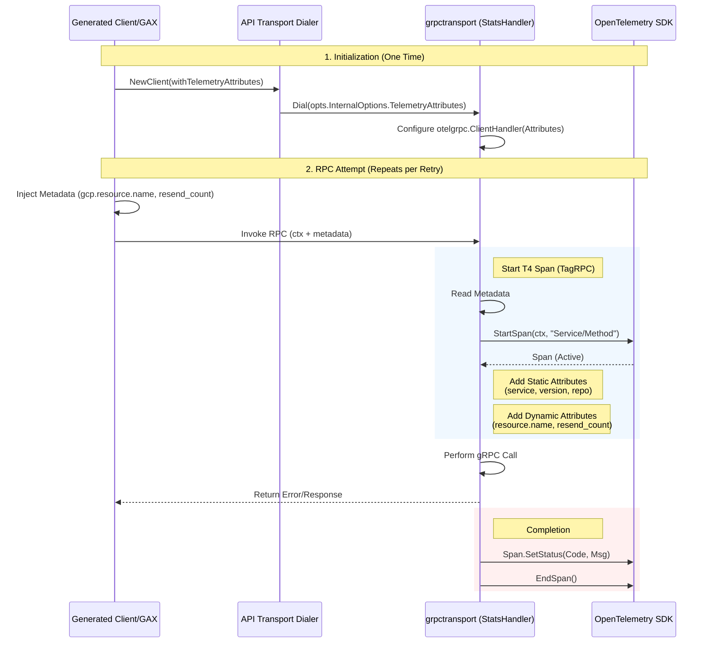

# OpenTelemetry Attribute Enrichment for Go Client Libraries

| |
| :---: |

Author: Gemini | Last Updated: 2025-12-29 | Status: Draft
Project: Cloud SDK Go Tracing | Self link: N/A

# Objective

Enable Google Cloud Go client libraries to emit OpenTelemetry spans enriched with required static (Client Identity) and dynamic (Request/Response) attributes, aligning with [Client Libraries Observability (CLO) v1](http://go/clo:product-requirements-v1) standards.

# Background

Current Go client libraries generate basic network spans (T4) via `grpctransport` (using `otelgrpc`) and `httptransport` (using `otelhttp`). However, these spans currently only contain default attributes.

**The Problem:**
These spans lack critical context required for App-Centric Observability:
*   **Who is calling?** (Static): `gcp.client.service`, `gcp.client.version`, `gcp.client.repo`.
*   **What are they calling?** (Dynamic): `gcp.resource.name` (e.g., the specific Secret or Bucket).
*   **What happened?** (Outcome):
    *   **Retries:** `gcp.grpc.resend_count` (how many attempts were made).
    *   **Status Code:** Detailed error classification (e.g., `UNAVAILABLE`).
    *   **Status Message:** The descriptive error message from the service.

Currently, users must manually configure these attributes if they want them, which is error-prone and inconsistent.

# Overview

We propose a distributed responsibility model across the client stack.

**Feature Gating:**
All behavioral changes described below (static attributes, dynamic enrichment, error handling updates) will be guarded by a feature flag. Code in utilities and generated clients will use `gax.IsFeatureEnabled("TRACING")` to check for the presence of `GOOGLE_SDK_GO_EXPERIMENTAL_TRACING=true` (value case-insensitive). If disabled, the library behaves exactly as it does today. This gate will be removed after a period of opt-in testing.

```mermaid
graph TD
    UserCode[User Code] --> GAPIC[Generated Client (GAPIC)]
    
    subgraph "Client Layer (Request)"
    GAPIC -- 1. Resource Name (Metadata) --> GAX[gax.Invoke]
    GAX -- 2. Retry Count (Metadata) --> TransportWrapper[Auth Transport Wrapper]
    end

    subgraph "Transport Layer (Start)"
    TransportWrapper -- 3. Configures Static Attrs --> OTelHandler[OTel Handler]
    TransportWrapper -- 4. Reads Metadata & Enriches Span --> OTelSDK[OpenTelemetry SDK]
    end

    OTelHandler -- Starts Span --> OTelSDK
    
    TransportWrapper -- 5. RPC Call --> Network[Network (gRPC/HTTP)]
    Network -- 6. Response/Error --> TransportWrapper
    
    subgraph "Transport Layer (End)"
    TransportWrapper -- 7. Inspects Error/Status & Enriches Span --> OTelSDK
    end
```

### Lifecycle of a Span (gRPC Example)

The following sequence illustrates how a single T4 network span is created and enriched.



# Detailed Design

## Component Responsibilities

| Component | Responsibility | Key Actions |
| :--- | :--- | :--- |
| **`gapic-generator-go`** | **Resource & Identity** | Generates code to extract `gcp.resource.name` and static identity (`service`, `version`). Injects these into the context/metadata. **Checks Feature Flag.** |
| **`google-api-go-client`** | **API Bridge** | Provides `internaloption.WithTelemetryAttributes` to bridge generated options to the `auth` library. |
| **`gax-go`** | **Retry Tracking** | Tracks the current attempt number in the retry loop. Injects `gcp.grpc.resend_count` into the context/metadata. **Checks Feature Flag.** |
| **`google-cloud-go/auth`** | **Span Enrichment** | Implements Transport Wrappers (`otelHandler` for gRPC, `RoundTripper` for HTTP). Reads metadata from context to enrich spans with static and dynamic attributes. Enabled via options passed from Client. |
| **Transport Wrappers** | **Error Handling** | Inspects every network response/error. Enriches the T4 span with strict error attributes (`error.type`, `grpc.status` in UPPER_CASE) before closing it. |

## 1. Static Attributes (Identity)
**Owner:** `cloud.google.com/go/auth` (`grpctransport` & `httptransport`)

The transport layer is responsible for "stamping" every span with the client's identity. This is configured once during client initialization.

*   **Configuration:** We introduce `InternalOptions.TelemetryAttributes` (a `map[string]string`) in both `grpctransport` and `httptransport`. These attributes represent the static identity of the client and are applied to all telemetry signals (spans and metrics) to enable correlation. This follows the "Universal Attributes" classification defined in "Tracing Requirements for Go Client Libraries".
*   **Flow (gRPC):** `grpctransport` configures `otelgrpc.ClientHandler` with `WithSpanAttributes`.
*   **Flow (HTTP):** `httptransport` configures `otelhttp` options using `WithSpanOptions(trace.WithAttributes(...))`.

## 2. API Option Bridge
**Owner:** `google-api-go-client/option`

Since generated clients rely on `google.golang.org/api/option`, we must bridge the new telemetry attributes to the `auth` library.

*   **New Option:** `internaloption.WithTelemetryAttributes(map[string]string)` will be added.
*   **Storage:** `internal.DialSettings` will store this map.
*   **Propagation:** The transport dialers in `google-api-go-client` (specifically `dialPoolNewAuth` for gRPC and `newClientNewAuth` for HTTP) will retrieve this map from `DialSettings` and pass it to the `auth` library via `InternalOptions`.

## 3. Dynamic Attributes (Resource Name)
**Owner:** **Generated Client (GAPIC)**

The transport layer cannot know about specific API fields (like `req.Parent` vs `req.Name`). Therefore, the generated code is responsible for extracting this information at runtime.

*   **Mechanism:** Context Injection + Transport Wrapper.
*   **Reason:** Standard gRPC interceptors run *before* the OpenTelemetry StatsHandler creates the span. Therefore, interceptors cannot directly modify the span. Instead, they must pass data via the context to the transport layer. The generator identifies the correct resource identifier field by reusing the existing logic that parses `google.api.http` and `google.api.routing` annotations for request header parameters.

### gRPC Implementation
*   **Injection:** Generated client checks `gax.IsFeatureEnabled("TRACING")`. If enabled, it injects resource name into **Outgoing Context Metadata** (key: `gcp.resource.name`).
*   **Enrichment:** `grpctransport` uses a `stats.Handler` wrapper. In `TagRPC`, it reads the metadata and sets attributes on the newly created span.

### HTTP Implementation
*   **Injection:** Generated client checks `gax.IsFeatureEnabled("TRACING")`. If enabled, it injects resource name into the `context.Context` using a private key (e.g., `internal.WithResourceName`).
*   **Enrichment:** `httptransport` inserts a custom `http.RoundTripper` *inside* the `otelhttp` transport.
    1.  `otelhttp` starts the span.
    2.  Custom Tripper runs: `span := trace.SpanFromContext(req.Context())`.
    3.  Custom Tripper reads resource name from `req.Context()`.
    4.  Custom Tripper sets attributes on the span.
    5.  Custom Tripper calls `base.RoundTrip`.

### Impacted Modules & Code Location

1.  **`gapic-generator-go` (The Generator):** Must be updated to generate logic that appends the resource name to the context (Metadata for gRPC, Context Key for HTTP) *conditionally* based on the result from `gax.IsFeatureEnabled("TRACING")` in client code.
2.  **Generated Clients:** Will contain the extraction and injection logic.
3.  **`google-cloud-go/auth` (This Repo):** Implements the wrappers in `grpctransport` and `httptransport`.

## 4. Failure & Retry Attributes
**Owner:** Shared (`otelgrpc`/`otelhttp`, `gax`, & Generated Client)

*   **Standard Errors:** `otelgrpc` and `otelhttp` automatically capture standard status codes.
*   **Retry Counts:** `gax.Invoke` will track the attempt count.

### Code Location & Mechanism

1.  **`gax-go` (Retry Logic):**
    *   **Change:** `gax.Invoke` checks `gax.IsFeatureEnabled("TRACING")`. If enabled, it injects the attempt count into the context metadata (key: `gcp.grpc.resend_count`).
    *   **Compatibility:** This is strictly additive via context/metadata.
2.  **`google-cloud-go/auth` (This Repo):**
    *   **Dynamic Attributes (`TagRPC`):** The `stats.Handler` wrapper reads metadata (`gcp.resource.name`, `resend_count`) and sets attributes on span creation.
    *   **Error Attributes (`HandleRPC`):** The wrapper implements `HandleRPC` to inspect the final status of the call. It explicitly sets:
        *   `error.type`: The canonical gRPC status code in UPPER_CASE (e.g., "UNAVAILABLE").
        *   `grpc.status`: The same upper-case code.
        *   `status.message`: The descriptive error message.

# Validation Plan

1.  **Static Attributes:**
    *   Unit tests in `grpctransport` and `httptransport` will verify attribute injection.
2.  **Dynamic Attributes & Retries:**
    *   Validation will occur in the **GAPIC generator** test suite.
    *   Integration tests will verify that `gcp.resource.name` is correctly extracted.

# Alternatives Considered

## Static Attributes via Struct Fields
We considered using explicit fields (e.g., `TelemetryServiceName`, `TelemetryClientVersion`) in `InternalOptions` because it offers strict type safety and enforces a clear contract. We went with **`map[string]string`** because it provides greater flexibility, decoupling the release cycle of `google-cloud-go/auth` from the evolving telemetry requirements of the client generators.

## Dynamic Attributes via Transport Reflection
We considered having `grpctransport` use reflection to find fields named "name" or "parent" because it would centralize logic in the transport layer. We went with **Generated Interceptors/Logic** because generated code knows the exact types and fields at compile time, making the extraction significantly more performant, type-safe, and robust against schema changes compared to runtime reflection.