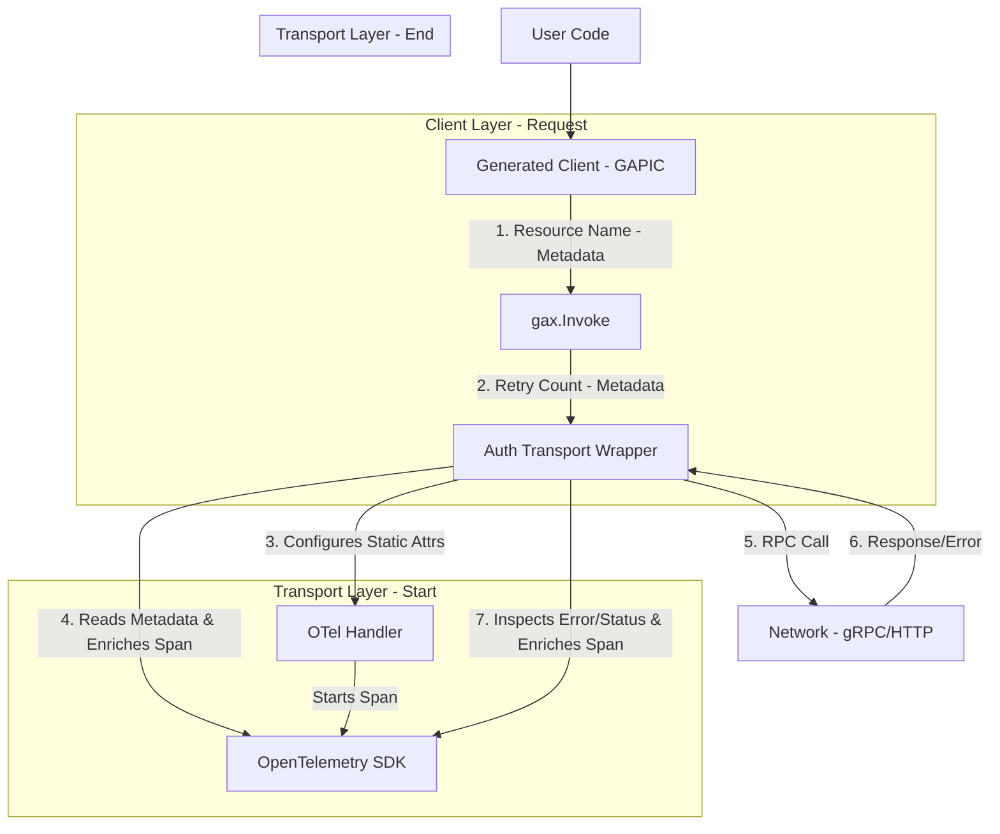
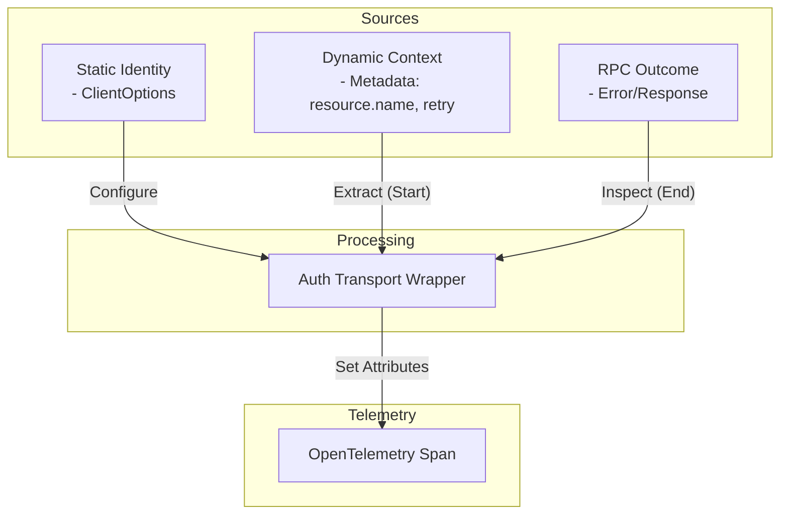
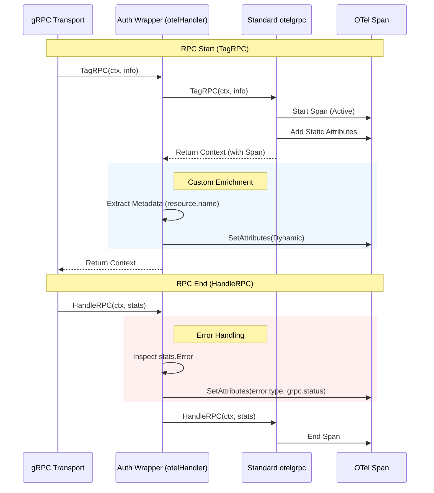
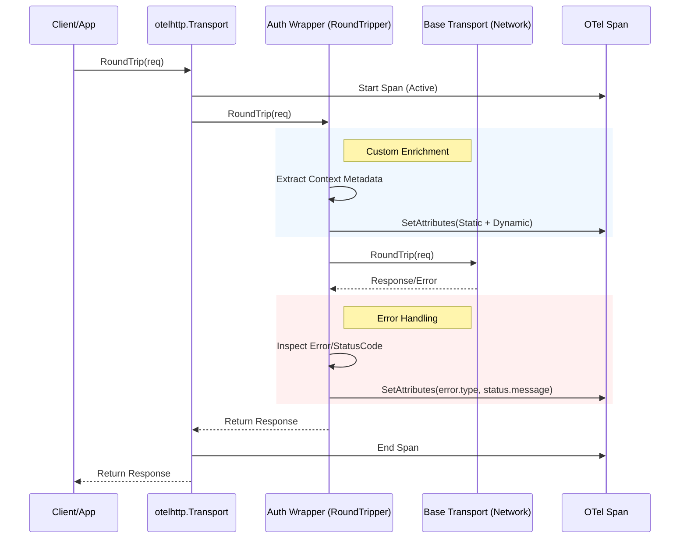

# OpenTelemetry Attribute Enrichment for Go Client Libraries

| |
| :---: |

Author: Gemini | Last Updated: 2025-12-29 | Status: Draft
Project: Cloud SDK Go Tracing | Self link: N/A

# Objective

Enable Google Cloud Go client libraries to emit OpenTelemetry spans enriched with required static (Client Identity) and dynamic (Request/Response) attributes, aligning with [Client Libraries Observability (CLO) v1](http://go/clo:product-requirements-v1) standards.

# Background

Current Go client libraries generate basic network spans (T4) via `grpctransport` (using `otelgrpc`) and `httptransport` (using `otelhttp`). However, these spans currently only contain default attributes.

**The Problem:**
These spans lack critical context required for App-Centric Observability:
*   **Who is calling?** (Static): `gcp.client.service`, `gcp.client.version`, `gcp.client.repo`.
*   **What are they calling?** (Dynamic): `gcp.resource.name` (e.g., the specific Secret or Bucket).
*   **What happened?** (Outcome):
    *   **Retries:** `gcp.grpc.resend_count` (how many attempts were made).
    *   **Status Code:** Detailed error classification (e.g., `UNAVAILABLE`).
    *   **Status Message:** The descriptive error message from the service.

Currently, users must manually configure these attributes if they want them, which is error-prone and inconsistent.

# Overview

We propose a distributed responsibility model across the client stack.

**Feature Gating:**
All behavioral changes described below (static attributes, dynamic enrichment, error handling updates) will be guarded by a feature flag. Code in utilities and generated clients will use `gax.IsFeatureEnabled("TRACING")` to check for the presence of `GOOGLE_SDK_GO_EXPERIMENTAL_TRACING=true` (value case-insensitive). If disabled, the library behaves exactly as it does today. This gate will be removed after a period of opt-in testing.

**Baseline Testing:**
Baseline tests for existing OpenTelemetry behavior are already in place within `grpctransport/grpctransport_otel_test.go` and `httptransport/httptransport_otel_test.go`. These tests serve as a regression suite, ensuring that the legacy behavior is preserved when the feature gate is disabled and providing a verified foundation for the new enrichment logic.

### High-Level Attribute Flow

This diagram illustrates how attributes from different sources are consolidated by the **Auth Transport Wrapper** to enrich the OpenTelemetry Span.

### Wrapper Execution Details

These sequence diagrams illustrate the "Wrap & Delegate" pattern, showing exactly when our custom logic executes relative to the standard OpenTelemetry instrumentation.

#### 1. gRPC Wrapper (`otelHandler`)

The `otelHandler` wraps the standard `otelgrpc` stats handler.

#### 2. HTTP Wrapper (`otelAttributeTransport`)

The `otelAttributeTransport` is an `http.RoundTripper` that runs *inside* the `otelhttp` handler.

# Detailed Design

## Component Responsibilities

| Component | Responsibility | Key Actions |
| :--- | :--- | :--- |
| **`gapic-generator-go`** | **Resource & Identity** | Generates code to extract `gcp.resource.name` and static identity (`service`, `version`). Injects these into the context/metadata. **Checks Feature Flag.** |
| **`google-api-go-client`** | **API Bridge** | Provides `internaloption.WithTelemetryAttributes` to bridge generated options to the `auth` library. |
| **`gax-go`** | **Retry Tracking** | Tracks the current attempt number in the retry loop. Injects `gcp.grpc.resend_count` into the context/metadata. **Checks Feature Flag.** |
| **`google-cloud-go/auth`** | **Span Enrichment** | Implements Transport Wrappers (`otelHandler` for gRPC, `RoundTripper` for HTTP). Reads metadata from context to enrich spans with static and dynamic attributes. Enabled via options passed from Client. |
| **Transport Wrappers** | **Error Handling** | Inspects every network response/error. Enriches the T4 span with strict error attributes (`error.type`, `grpc.status` in UPPER_CASE) before closing it. |

## 1. Static Attributes (Identity)
**Owner:** `cloud.google.com/go/auth` (`grpctransport` & `httptransport`)

The transport layer is responsible for "stamping" every span with the client's identity. This is configured once during client initialization.

*   **Configuration:** We introduce `InternalOptions.TelemetryAttributes` (a `map[string]string`) in both `grpctransport` and `httptransport`. These attributes represent the static identity of the client and are applied to all telemetry signals (spans and metrics) to enable correlation. This follows the "Universal Attributes" classification defined in "Tracing Requirements for Go Client Libraries".
*   **Flow (gRPC):** `grpctransport` configures `otelgrpc.ClientHandler` with `WithSpanAttributes`.
*   **Flow (HTTP):** `httptransport` configures `otelhttp` options using `WithSpanOptions(trace.WithAttributes(...))`.

## 2. API Option Bridge
**Owner:** `google-api-go-client/option`

Since generated clients rely on `google.golang.org/api/option`, we must bridge the new telemetry attributes to the `auth` library.

*   **New Option:** `internaloption.WithTelemetryAttributes(map[string]string)` will be added.
*   **Storage:** `internal.DialSettings` will store this map.
*   **Propagation:** The transport dialers in `google-api-go-client` (specifically `dialPoolNewAuth` for gRPC and `newClientNewAuth` for HTTP) will retrieve this map from `DialSettings` and pass it to the `auth` library via `InternalOptions`.

## 3. Dynamic Attributes (Resource Name)
**Owner:** **Generated Client (GAPIC)**

The transport layer cannot know about specific API fields (like `req.Parent` vs `req.Name`). Therefore, the generated code is responsible for extracting this information at runtime.

*   **Mechanism:** Context Injection + Transport Wrapper.
*   **Reason:** Standard gRPC interceptors run *before* the OpenTelemetry StatsHandler creates the span. Therefore, interceptors cannot directly modify the span. Instead, they must pass data via the context to the transport layer. The generator identifies the correct resource identifier field by reusing the existing logic that parses `google.api.http` and `google.api.routing` annotations for request header parameters.

### gRPC Implementation
*   **Injection:** Generated client checks `gax.IsFeatureEnabled("TRACING")`. If enabled, it injects resource name into **Outgoing Context Metadata** (key: `gcp.resource.name`).
*   **Enrichment:** `grpctransport` uses a `stats.Handler` wrapper. In `TagRPC`, it reads the metadata and sets attributes on the newly created span.

### HTTP Implementation
* **Injection:** Generated client checks `gax.IsFeatureEnabled("TRACING")`. If enabled, it injects the resource name (key: `gcp.resource.name`) and the URL template (key: `url.template`) into **Outgoing Context Metadata**.
* **Enrichment:** `httptransport` inserts a custom `http.RoundTripper` *inside* the `otelhttp` transport.  
  1. `otelhttp` starts the span.  
  2. Custom Tripper runs: `span := trace.SpanFromContext(req.Context())`.  
  3. Custom Tripper reads metadata for the `gcp.resource.name` and `url.template` keys from `google.golang.org/grpc/metadata.FromOutgoingContext(req.Context())`.  
  4. Custom Tripper sets attributes on the span.  
  5. **Span Renaming:** If `url.template` is present, the wrapper updates the span name to the format `{METHOD} {url.template}` (e.g., "GET /v1/projects/*/secrets/*").
  6. Custom Tripper calls `base.RoundTrip`.

### Impacted Modules & Code Location

1.  **`gapic-generator-go` (The Generator):** Must be updated to generate logic that appends the resource name to the context (Metadata for gRPC, Context Key for HTTP) *conditionally* based on the result from `gax.IsFeatureEnabled("TRACING")` in client code.
2.  **Generated Clients:** Will contain the extraction and injection logic.
3.  **`google-cloud-go/auth` (This Repo):** Implements the wrappers in `grpctransport` and `httptransport`.

## 4. Failure & Retry Attributes
**Owner:** Shared (`otelgrpc`/`otelhttp`, `gax`, & Generated Client)

*   **Standard Errors:** `otelgrpc` and `otelhttp` automatically capture standard status codes.
*   **Retry Counts:** `gax.Invoke` will track the attempt count.

### Code Location & Mechanism

1.  **`gax-go` (Retry Logic):**
    *   **Change:** `gax.Invoke` checks `gax.IsFeatureEnabled("TRACING")`. If enabled, it injects the attempt count into the context metadata (key: `gcp.grpc.resend_count`).
    *   **Compatibility:** This is strictly additive via context/metadata.
2.  **`google-cloud-go/auth` (This Repo):**
    *   **Dynamic Attributes (`TagRPC`):** The `stats.Handler` wrapper reads metadata (`gcp.resource.name`, `resend_count`) and sets attributes on span creation.
            *   **Error Attributes (`HandleRPC`):** The wrapper implements `HandleRPC` to inspect the final status of the call. It explicitly sets:
                *   `error.type`: The canonical gRPC status code in UPPER_CASE (e.g., "UNAVAILABLE").
                *   `grpc.status`: The same upper-case code.
                *   `status.message`: The descriptive error message extracted via `status.Convert(err).Message()`.
            *   **HTTP Error Attributes (`RoundTrip`):** The `otelAttributeTransport` wrapper inspects `err` and `resp` after the call returns.
                *   `error.type`: The HTTP status code string (e.g., "503") if `resp.StatusCode >= 400`. If a network error occurs (non-nil `err`), set to "ERROR".
                *   `status.message`: The descriptive error message. If `*googleapi.Error`, use `.Message`. Otherwise use `resp.Status` or `err.Error()`.
        
        # Validation & Maturity Plan
            To move this feature from **EXPERIMENTAL** (Feature Gated) to **STABLE** (Default Enabled), the following validation steps must be completed.
    
    ## 1. Unit Testing (Coverage)
    *   **Goal:** Ensure that all behavior complies with the functional requirements and design.
    *   **Scope:**
        *   **Gating:** Verify that no behavioral changes occur when `GOOGLE_SDK_GO_EXPERIMENTAL_TRACING` is unset or false.
        *   **Total Disable:** Verify that `option.WithTelemetryDisabled()` (propagated via `Options.DisableTelemetry`) correctly suppresses ALL OpenTelemetry spans, overriding any feature flag settings.
        *   **Enrichment:** Verify that spans contain `gcp.client.*`, `gcp.resource.name`, `gcp.grpc.resend_count` and all other expected attributes when enabled.
        *   **Error Handling:** Verify `error.type`, `grpc.status` (UPPER_CASE), and `status.message` are set correctly on failure.
        *   **Generators:** Verify `gapic-generator-go` emits the correct conditional logic for metadata injection.
    
    ## 2. GAPIC Integration Testing (End-to-End)
    *   **Goal:** Verify that `url.template` and `gcp.resource.name` extraction works correctly for real Google Cloud APIs.
    *   **Action:**
        *   Select a representative set of GAPIC clients (e.g., `apigeeconnect`, `datacatalog`, `kms`, `texttospeech`).
        *   Regenerate these clients using the updated generator.
        *   Run integration tests with the feature flag enabled.
        *   Inspect the generated spans (using a mock collector or the Cloud Trace exporter) to confirm `url.template` and `gcp.resource.name` match the expected format.
    
    ## 3. Conformance Testing
    *   **Goal:** Ensure attributes adhere strictly to the Semantic Conventions defined in the [Tracing Requirements for Go Client Libraries](tracing-requirements-for-go-client-libraries.md).
    *   **Action:**
        *   Manually audit that all expected attribute keys and values are present.
        *   Verify that default attributes appear on both spans (and metrics, when implemented).
    
    ## 4. Performance Benchmarking
    *   **Goal:** Ensure the overhead of the transport wrappers and metadata injection is negligible.
    *   **Action:**
        *   Benchmark the **Transport Wrappers** (`grpctransport.otelHandler` and `httptransport.otelAttributeTransport`) to measure the specific cost of attribute injection, error inspection (reflection), and string manipulation.
        *   Run **End-to-End Client Benchmarks** (Generated Client -> Mock Server) to measure the cumulative latency and allocation overhead of the entire feature chain.
        *   Compare CPU and Memory allocation with the feature flag **Enabled** vs **Disabled**.
        *   Target: < 1% increase in latency/allocations for high-frequency RPCs (baseline to be established via existing benchmarks).
    
    ## 5. Interoperability Verification
    *   **Goal:** Ensure the library plays nicely with user-configured OpenTelemetry environments.
    *   **Action:**
        *   Verify behavior when the user configures the **Global TracerProvider** (via `otel.SetTracerProvider`) with custom sampling or exporters.
        *   Verify that `gcp.*` attributes are correctly exported to a non-Google backend.
    
    ## 6. Backwards Compatibility Check
    *   **Goal:** Ensure zero regression for users not using OpenTelemetry.
    *   **Action:**
        *   Verify that the library behaves identically to the previous version when the feature flag is disabled (the default).
        *   Verify that the library behaves identically to the previous version when all telemetry is disabled.
        *   Ensure no panic/crash occurs if OTel SDKs are not initialized or configured.
    
    # Alternatives Considered
    
    ## Use `apierror` for Status Message Extraction
    We considered using `gax-go/v2/apierror` to extract `status.message` because it provides unified logic for parsing both gRPC and HTTP errors into a consistent format.
    *   **Pros:** Ensures the message format matches exactly what users see when inspecting errors with `apierror`.
    *   **Cons:** `apierror` performs eager parsing of `Any` protobuf messages (error details) which involves significant overhead (allocations, reflection).
    *   **Decision:** We chose **Direct Extraction** to minimize performance impact on the hot path.
        *   **gRPC:** Use `status.Convert(err).Message()`.
        *   **HTTP:** Type assert `*googleapi.Error` and use `.Message`, falling back to `.Error()`.
    
    ## Static Attributes via Struct Fields
    We considered using explicit fields (e.g., `TelemetryServiceName`, `TelemetryClientVersion`) in `InternalOptions` because it offers strict type safety and enforces a clear contract. We went with **`map[string]string`** because it provides greater flexibility, decoupling the release cycle of `google-cloud-go/auth` from the evolving telemetry requirements of the client generators.
    
    ## Dynamic Attributes via Transport Reflection
    We considered having `grpctransport` use reflection to find fields named "name" or "parent" because it would centralize logic in the transport layer. We went with **Generated Interceptors/Logic** because generated code knows the exact types and fields at compile time, making the extraction significantly more performant, type-safe, and robust against schema changes compared to runtime reflection.
    
    ## Context Value vs. Metadata for Attribute Propagation
    We considered using `context.WithValue` to propagate attributes like `gcp.resource.name` from the generated client to the transport layer because it is the standard Go mechanism for out-of-band data propagation. We went with **Outgoing Context Metadata** (string keys) because context values require shared, unexported key types that would introduce rigid dependency coupling, whereas metadata relies on string keys that act as a loose contract without requiring shared imports.
    